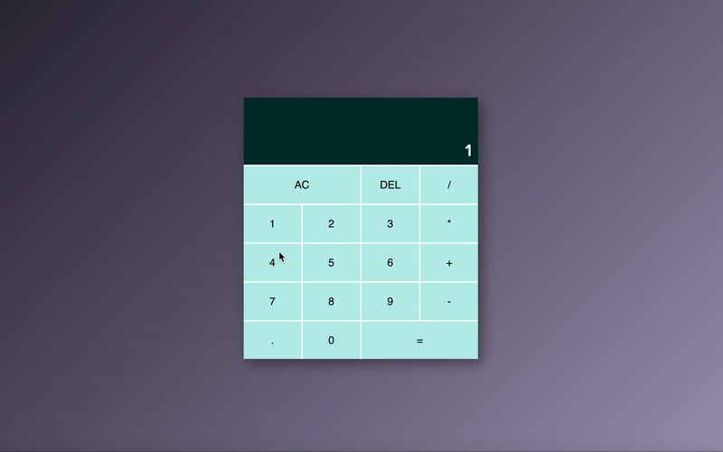

# React Calculator

A modern, fully responsive and accessible calculator app built with **React**. This project showcases advanced React concepts like **custom hooks**, **component composition**, and **keyboard accessibility**.

---

## Features

- **Advanced React Techniques**

  - Context API for global state management
  - Custom hooks for keyboard input handling
  - Component composition for clean, reusable code

- **Accessibility**

  - Keyboard input
  - Screen reader friendly

- 📱 **Responsive Design**

  - Fluid layout using modern CSS Grid techniques
  - Adjusts dynamically based on screen size

---

## Demo

---

## Tech Stack

- React
- CSS Modules
- HTML5

---

## 🧠 Concepts Demonstrated

| Concept                  | Description                                                          |
| ------------------------ | -------------------------------------------------------------------- |
| `useContext`             | Shared calculator logic and UI state                                 |
| `useEffect`              | Event listener management and DOM updates                            |
| Custom Hook (`useKey`)   | Adds key-based behavior to buttons and components                    |
| Component Composition    | Reusable `Button` logic across number, operator, and utility buttons |
| Accessibility Attributes | aria attributes, semantic roles, keyboard support                    |
| Responsive Grid Layout   | CSS Grid with fluid design                                           |

---
